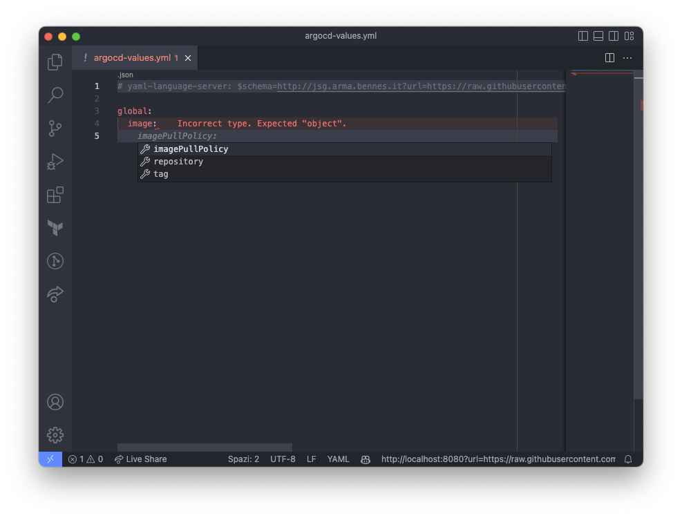

# Json Schema Generator

This is a simple API to generate json schema from data.
Why do we need this? See [common-use-cases](#common-use-cases)

## Getting Started

```
docker run --rm -ti -p 8080:8080 ghcr.io/bennesp/json-schema-generator:latest
```

Then, you can access the API at `http://localhost:8080`:

```
curl -X GET "http://localhost:8080?url=https://raw.githubusercontent.com/argoproj/argo-helm/main/charts/argo-cd/values.yaml"
```

## Parameters

| Parameter  | Default | Optional | Description                                                                                                                                                |
|------------|---------|----------|------------------------------------------------------------------------------------------------------------------------------------------------------------|
| `data`     | -       | no       | The data you want to generate a schema for.<br/>Note: use either this or `url`                                                                             |
| `url`      | -       | no       | A URL where your data to generate a schema for is returned upon a GET request.<br/>Note: use either this or `data`                                         |
| `encoding` | nop     | yes      | A supported encoding to use to decode `data` or `url` content. Can be `nop`, `base64` or `hex`                                                             |
| `input`    | yaml    | yes      | A supported format to use to parse the input `data` or `url` content. Can be `yaml` or `json`                                                              |
| `output`   | json    | yes      | A supported format to use to serialize the schema generated. Can be `yaml` or `json`                                                                       |
| `generate` | true    | yes      | A boolean specifying if the `data` or `url` content should generate a schema or if they should be taken as they are<br/>Useful for CRDs (see examples)     |
| `selector` | -       | yes      | A string defining the path to select on the `data` or `url` content to be used instead of the full content. Eg.: `/spec/versions/0/schema/openAPIV3Schema` |

## API description

Data can be passed to the API in a couple of ways:

- As a data string, with the query parameter `data`
- As an url, with the query parameter `url`

**Note**: only one and exactly one of the two parameters must be used at a time

Moreover, you can specify a supported encoding to parse both the `data` or the `url` content,
with the query parameter `encoding`.
Supported encoders are:

- `nop` (default): just returns the data as is
- `base64`: decodes the data using base64
- `hex`: decodes the data using hexadecimal (eg: '41424344' is decoded as 'ABCD')

Moreover, you can specify a supported format to parse the input and to serialize the
output for both the `data` or the `url` content, with the query parameters
`input` and `output`.
Supported formats are:

- `yaml` (default for input): parses the data as yaml
- `json` (default for output): parses the data as json

## Common use-cases

Since this is a very generic API, it can be exploited in many ways.

Here I report the major use-cases I am aware of. Open an issue if you wish to contribute to this list.

### VSCode YAML extension

If you have the [YAML extension](https://marketplace.visualstudio.com/items?itemName=redhat.vscode-yaml) installed, then
you can integrate this in vscode.

To provide json schema completion just configure the YAML extension with the correct schema for your file,
using its own settings or just put a comment with `# yaml-language-server: $schema=<URL of the API>`.
See below for more examples.

After that, you can use the auto-completion as usual.
For example, it follows a screenshot of the auto-completion for the `values.yaml` helm file of the argo-cd project:



#### Helm Values

Helm values typically need only the parameter `url`, and you can leave anything else to the default value.

| Parameter | Value                      |
|-----------|----------------------------|
| `url`     | The Helm `values.yaml` url |

Example:

```yaml
# yaml-language-server: $schema=https://jsg.arma.bennes.it?url=https://raw.githubusercontent.com/argoproj/argo-helm/main/charts/argo-cd/values.yaml
```


#### Kubernetes CRDs

Kubernetes CRDs already contain an OpenAPI schema in the field `openAPIV3Schema` which, from version 3.1.0,
is 100% compatible with json schema. As such, you already have the schema included in the CRD, in a manner.

If you then want to use this API, you can use these parameters:

| Parameter  | Value                                                                   |
|------------|-------------------------------------------------------------------------|
| `url`      | The CRD url                                                             |
| `generate` | `false`, since we already have the schema in the CRD as explained above |
| `selector` | `/spec/versions/0/schema/openAPIV3Schema`                               |

Example:

```yaml
# yaml-language-server: $schema=https://jsg.arma.bennes.it?url=https://raw.githubusercontent.com/argoproj/argo-cd/master/manifests/crds/application-crd.yaml&generate=false&selector=/spec/versions/0/schema/openAPIV3Schema
```
